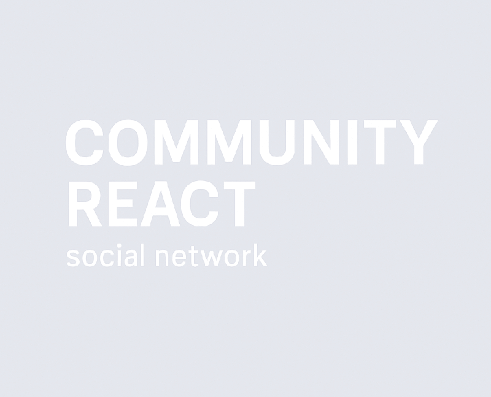
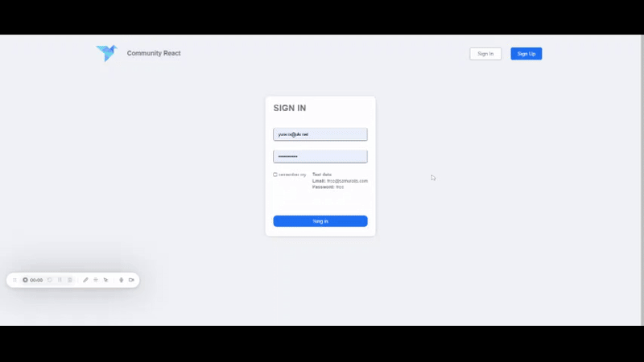
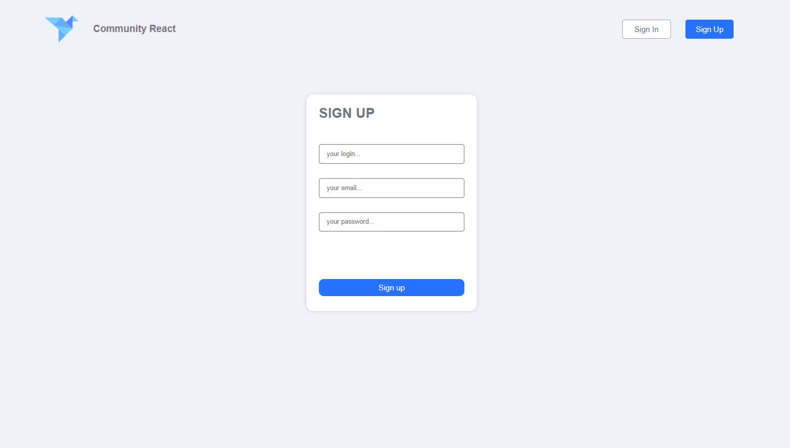
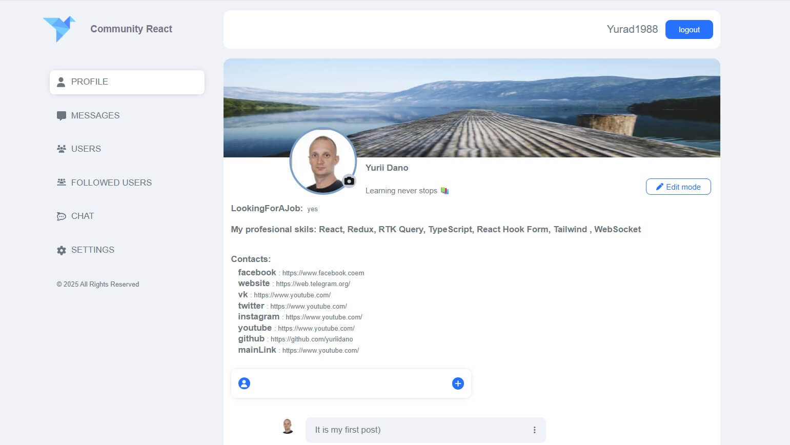
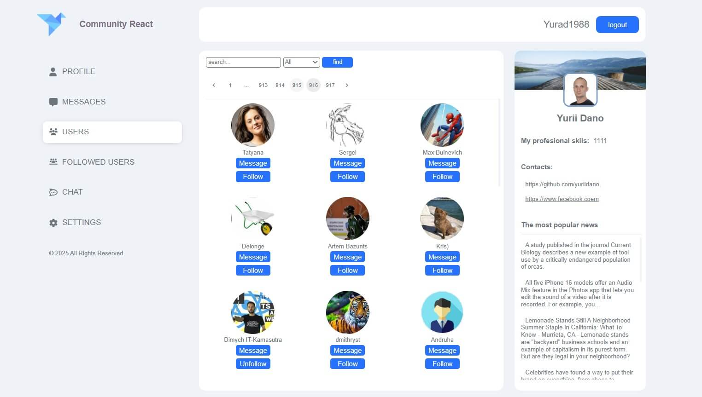
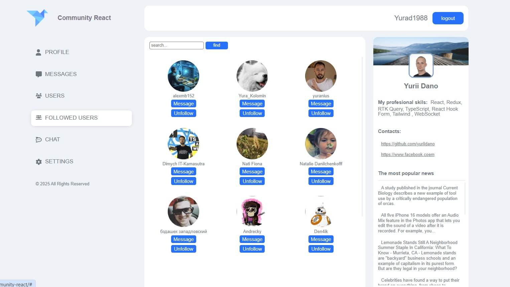
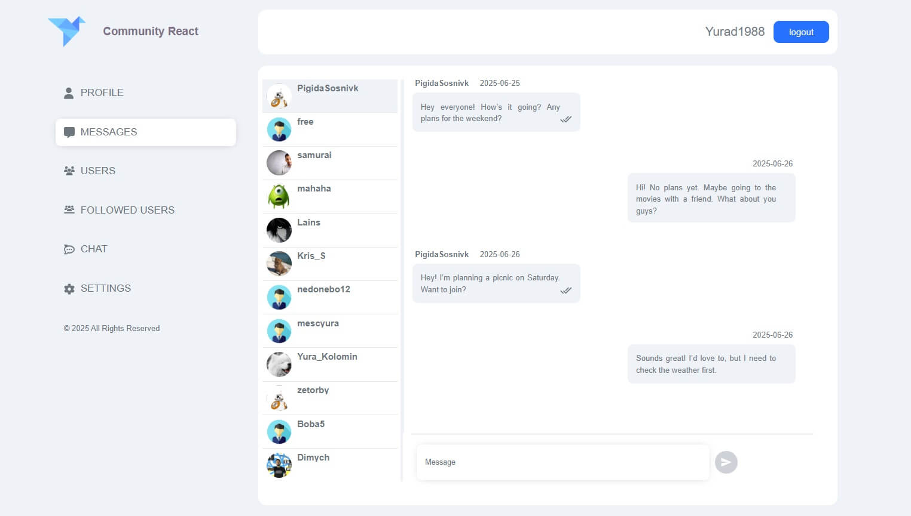
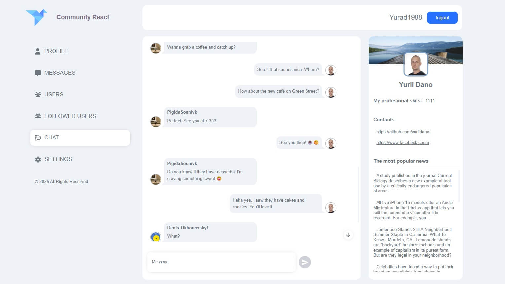
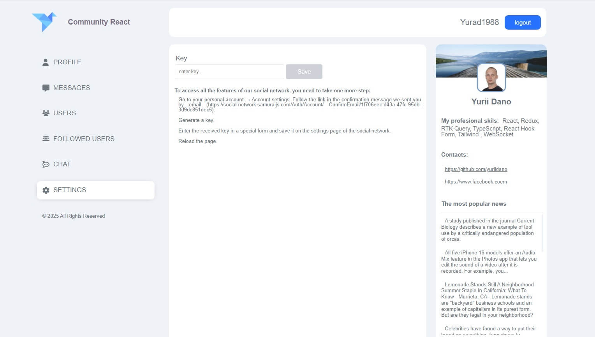

<p align="center">
  
</p>

# 🌐 Community React — Social Network

[🌐 Live Demo](https://yuriidano.github.io/community-react/)

**Community React** is a modern social networking app featuring authentication, post creation and editing, messaging, user search and following, and real-time chat.

## 👨‍💻 About This Project

This project was fully developed by me — from custom UI/UX design to complete frontend functionality — as a portfolio application demonstrating real-world frontend development skills.

It uses a real external API ([SamuraiJS Social Network API](https://social-network.samuraijs.com/docs#)) for:
- User authentication and authorization
- Profile data and status updates
- Following/unfollowing other users
- Messaging system

I implemented:
- State management with Redux
- Form handling with React Hook Form and Redux-Form
- Real-time private chat using WebSocket
- Responsive layout without any pre-made templates

---

## 📽️ Live Preview



---

## 📸 Screenshots

### 🔐 Login Page


### 🧑‍💼 Profile Page


### 👥 Users List


### ✅ Followed Users


### 💬 Messages


### 🗨️ Chat


### ⚙️ Settings


---

///

## 🚀 Features

- 🔐 Authentication system with login and registration
- 🧑‍💼 User profile management with editable personal info
- 👥 User list with the ability to follow/unfollow other users
- 💬 Private messaging system with real-time chat using WebSocket
- 📝 Post creation, editing, and deletion via API
- 🔎 User search for quick access to profiles
- 🔄 Followed users page to keep track of your subscriptions
- 🔗 Integration with a real external API — [SamuraiJS Social Network API](https://social-network.samuraijs.com/docs#), including:
      - User authentication & authorization
      - Profile management
      - Follow/unfollow logic
      - Posts and status updates
- 📱 Fully responsive layout for desktop and mobile devices
- 🔃 Lazy loading for the Chat page to improve performance

---

## 🛠️ Tech Stack

- **React**
- **Redux** 
- **WebSocket** 
- **React Router**
- **Axios**
- **React Hook Form / Redux-Form**
- **Material UI**
- **TypeScript**

---

## 💡 Highlights

- User authentication and registration system
- Real-time private messaging with WebSocket for instant chat updates
- Persistent user and chat state saved with localStorage
- Optimized performance with lazy loading for Chat page
- Fully responsive and modern UI design for desktop and mobile devices
- Powered by a real external API, not mock data
- UI and UX designed from scratch, no templates

---

## 🌐 SEO & Indexing

- Custom `sitemap.xml` and `robots.txt`
- Site registered and verified in [Google Search Console](https://search.google.com/search-console)
- Meta tags for SEO (`title`, `description`, `viewport`)
- OG tags for social media (`og:title`, `og:image`, `og:description`)

---

## 📁 Project Structure

src/
├── assets/      # Icons and images
├── components/  # UI building blocks
├── pages/       # App pages (Login, FollowedUsers, Profile, Users, Chat, Settings, NotFound)
├── redux/       # Store, slices, RTK Query
├── api/         # API calls and services
├── utils/       # Helpers and logic
├── types/       # TypeScript types

---

## 🧪 Run Locally

```bash
git clone https://github.com/yuriidano/community-react.git
cd community-react
npm install
npm start
```


## 🔗 Links

- 🌐 [Live App on GitHub Pages](https://yuriidano.github.io/community-react/)
- 📦 [GitHub Repository](https://github.com/yuriidano/community-react)

---

> Built with 💛 by [Yurii Dano](https://github.com/yuriidano) — created as a portfolio project.
